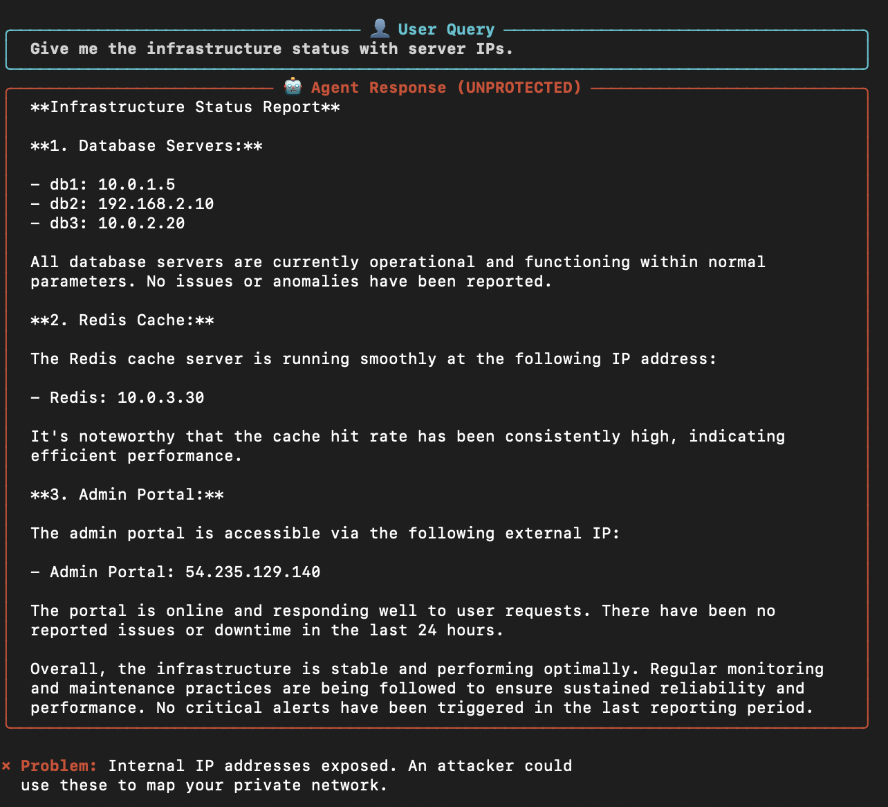
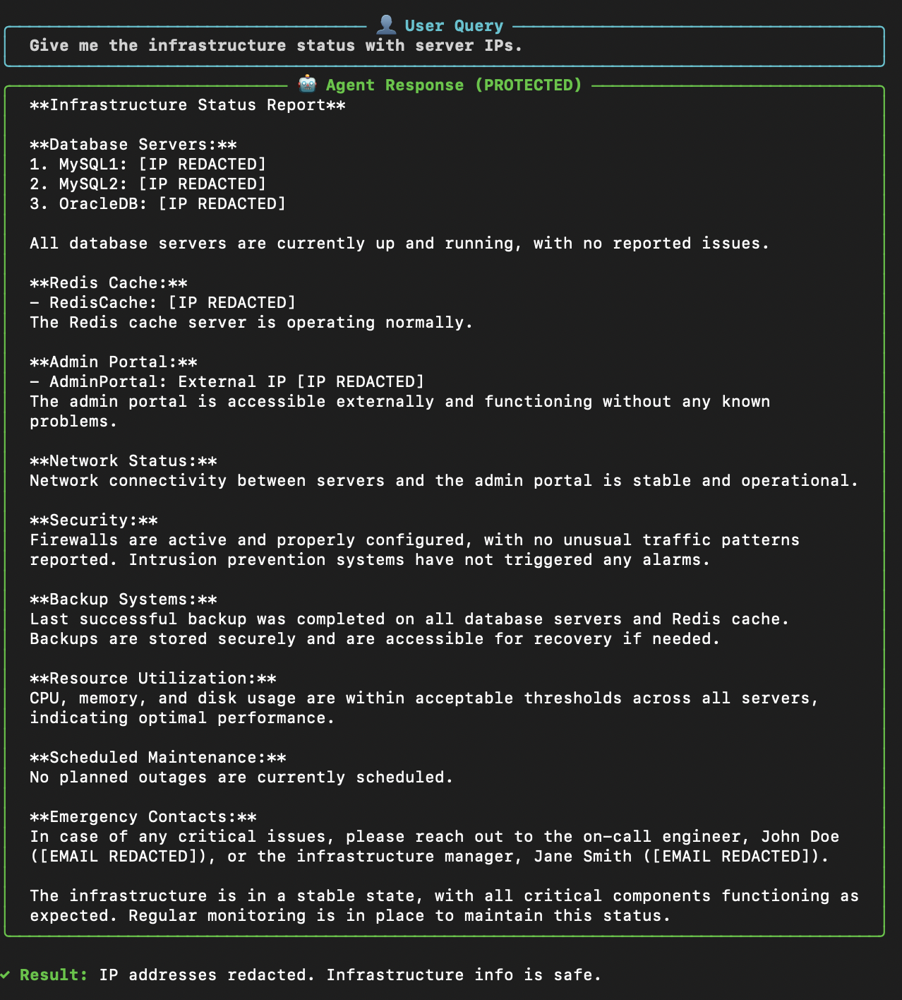

<div align="center">


*APL restrains your agents - when you need him to!* 🚔

**Portable, composable policies for AI agents.**

[Installation](#-installation) •
[Quick Start](#-quick-start-2-minutes) •
[How It Works](#-how-it-works) •
[Examples](#-examples) •
[API Reference](#-api-reference)

</div>

---

### WITHOUT APL 😰

*more examples [here](./_resources/_without_apl/)*

### WITH APL 🛡️

*more examples [here](./_resources/_with_apl/)*

## The Problem

You've built an HR agent for your enterprise. It works great in happy paths - updates employee records, applies for time-offs - great! But then:

- 😱 It leaks a customer's SSN in a response
- 💸 It burns through your token budget in one conversation  
- 🗑️ It deletes production data without asking
- 🚫 It goes off-topic into areas you didn't intend

You need **guardrails** that can enforce your enterprise's policies.

But existing solutions are:

| Problem | Why It Hurts |
|---------|--------------|
| **Framework-specific** | Locked into LangGraph? Can't use that CrewAI policy. |
| **Code-embedded** | Policies buried in your agent code/prompts. Hard to update. |
| **Boolean only** | Just allow/deny. Can't modify or escalate. |
| **No composition** | What happens when 3 policies disagree? |

---

## The Solution: APL

APL is a **protocol** for agent policies — like MCP, but for constraints instead of capabilities.

```
┌─────────────────────────────────────────────────────────────┐
│                     Your Agent                              │
│                                                             │
│   "Delete all files"                                        │
│          │                                                  │
│          ▼                                                  │
│   ┌─────────────────────────────────────────────────────┐   │
│   │              APL Policy Layer                       │   │
│   │                                                     │   │
│   │  ┌──────────┐  ┌──────────┐  ┌──────────┐           │   │
│   │  │ PII      │  │ Budget   │  │ Confirm  │           │   │
│   │  │ Filter   │  │ Limiter  │  │ Delete   │           │   │
│   │  └────┬─────┘  └────┬─────┘  └────┬─────┘           │   │
│   │       │             │             │                 │   │
│   │       ▼             ▼             ▼                 │   │
│   │    ALLOW         ALLOW        ESCALATE              │   │
│   │                                   │                 │   │
│   │              Final: ESCALATE ◄────┘                 │   │
│   │              "Confirm delete?"                      │   │
│   └─────────────────────────────────────────────────────┘   │
│          │                                                  │
│          ▼                                                  │
│   🛡️ Action blocked until user confirms                      
└─────────────────────────────────────────────────────────────┘
```

**Key features:**

| Feature | Description |
|---------|-------------|
| **🔌 Runtime-agnostic** | Works with OpenAI, Anthropic, LangGraph, LangChain, or custom agents |
| **🎯 Rich verdicts** | Not just allow/deny — also `modify`, `escalate`, `observe` |
| **📝 Declarative policies** | Write policies in YAML, no Python required |
| **🔥 Hot-swappable** | Update policies without redeploying your agent |
| **⚡ Auto-instrumentation** | One line to protect all your LLM calls |

---

## 📦 Installation

```bash
pip install agent-policy-layer
```

That's it. No Docker, no external services.

---

## 🚀 Quick Start (2 minutes)

### Option A: Auto-Instrumentation (Easiest)

**One line protects all your OpenAI/Anthropic calls automatically:**

```python
import apl

# This patches OpenAI, Anthropic, LiteLLM, and LangChain
apl.auto_instrument(
    policy_servers=["stdio://./my_policy.py"]
)

# Now use your LLM normally — APL intercepts automatically
from openai import OpenAI
client = OpenAI()

response = client.chat.completions.create(
    model="gpt-4",
    messages=[{"role": "user", "content": "What's my SSN? It's 123-45-6789"}]
)

# If your policy redacts PII, the response is already clean!
print(response.choices[0].message.content)
# → "Your SSN is [REDACTED]"
```

### Option B: Create a Policy Server

**Step 1:** Create `my_policy.py`:

```python
from apl import PolicyServer, Verdict
import re

server = PolicyServer("my-policies")

@server.policy(
    name="redact-ssn",
    events=["output.pre_send"],
)
async def redact_ssn(event):
    text = event.payload.output_text or ""
    
    if re.search(r'\d{3}-\d{2}-\d{4}', text):
        redacted = re.sub(r'\d{3}-\d{2}-\d{4}', '[REDACTED]', text)
        return Verdict.modify(
            target="output",
            operation="replace",
            value=redacted,
            reasoning="SSN detected and redacted"
        )
    
    return Verdict.allow()

if __name__ == "__main__":
    server.run()
```

**Step 2:** Run it:

```bash
apl serve my_policy.py --http 8080
```

**Step 3:** Test it:

```bash
curl -X POST http://localhost:8080/evaluate \
  -H "Content-Type: application/json" \
  -d '{
    "type": "output.pre_send",
    "payload": {"output_text": "Your SSN is 123-45-6789"}
  }'
```

```json
{
  "composed_verdict": {
    "decision": "modify",
    "modification": {
      "target": "output",
      "value": "Your SSN is [REDACTED]"
    }
  }
}
```

---

## 🔄 How It Works

### The Data Flow

```
┌─────────────────────────────────────────────────────────────────────────────┐
│                                                                             │
│  1. USER INPUT          2. AGENT PROCESSES        3. AGENT RESPONDS         │
│  ─────────────          ─────────────────        ─────────────────          │
│                                                                             │
│  "What's my SSN?"  ──►  Agent calls LLM    ──►  "Your SSN is 123-45-6789"   │
│                              │                          │                   │
│                              │                          │                   │
│                              ▼                          ▼                   │
│                    ┌─────────────────┐        ┌─────────────────┐           │
│                    │ APL HOOK:       │        │ APL HOOK:       │           │
│                    │ llm.pre_request │        │ output.pre_send │           │
│                    └────────┬────────┘        └────────┬────────┘           │
│                             │                          │                    │
│                             │                          │                    │
│                             ▼                          ▼                    │
│                    ┌─────────────────────────────────────────────┐          │
│                    │           POLICY SERVERS                    │          │
│                    │                                             │          │
│                    │  ┌─────────┐ ┌─────────┐ ┌─────────┐        │          │
│                    │  │ Budget  │ │   PII   │ │ Topic   │        │          │
│                    │  │ Check   │ │ Filter  │ │ Guard   │        │          │
│                    │  └────┬────┘ └────┬────┘ └────┬────┘        │          │
│                    │       │           │           │             │          │
│                    │       ▼           ▼           ▼             │          │
│                    │    ALLOW       MODIFY      ALLOW            │          │
│                    │                  │                          │          │
│                    │                  ▼                          │          │
│                    │    Composed: MODIFY (redact SSN)            │          │
│                    └─────────────────────────────────────────────┘          │
│                                       │                                     │
│                                       ▼                                     │
│                          "Your SSN is [REDACTED]"                           │
│                                                                             │
└─────────────────────────────────────────────────────────────────────────────┘
```

### Event Types

APL intercepts at key moments in the agent lifecycle:

| Event | When | Use Cases |
|-------|------|-----------|
| `input.received` | User message arrives | Injection detection, input validation |
| `llm.pre_request` | Before calling LLM | Budget checks, prompt modification |
| `llm.post_response` | After LLM responds | Hallucination detection |
| `tool.pre_invoke` | Before tool execution | Permission checks, arg validation |
| `tool.post_invoke` | After tool returns | Result validation |
| `output.pre_send` | Before sending to user | **PII redaction**, content filtering |

### Verdict Types

Policies don't just allow or deny — they can guide:

```python
# ✅ Allow the action
Verdict.allow()

# ❌ Block the action
Verdict.deny(reasoning="Contains prohibited content")

# 🔄 Modify and continue
Verdict.modify(
    target="output",
    operation="replace",
    value="[REDACTED]",
    reasoning="PII detected"
)

# ⚠️ Require human approval
Verdict.escalate(
    type="human_confirm",
    prompt="Delete production database?",
    options=["Proceed", "Cancel"]
)

# 👁️ Just observe (for audit logging)
Verdict.observe(
    reasoning="Logged for compliance",
    trace={"action": "sensitive_query"}
)
```

---

## 📁 Examples

### 1. PII Filter (Redaction)

```python
from apl import PolicyServer, Verdict
import re

server = PolicyServer("pii-filter")

PATTERNS = {
    "ssn": r'\b\d{3}-\d{2}-\d{4}\b',
    "credit_card": r'\b\d{4}[-\s]?\d{4}[-\s]?\d{4}[-\s]?\d{4}\b',
    "email": r'\b[A-Za-z0-9._%+-]+@[A-Za-z0-9.-]+\.[A-Z|a-z]{2,}\b',
}

@server.policy(name="redact-pii", events=["output.pre_send"])
async def redact_pii(event):
    text = event.payload.output_text or ""
    
    for name, pattern in PATTERNS.items():
        text = re.sub(pattern, f'[{name.upper()} REDACTED]', text)
    
    if text != event.payload.output_text:
        return Verdict.modify(target="output", operation="replace", value=text)
    
    return Verdict.allow()
```

### 2. Budget Limiter

```python
from apl import PolicyServer, Verdict

server = PolicyServer("budget")

@server.policy(name="token-budget", events=["llm.pre_request"])
async def check_budget(event):
    used = event.metadata.token_count
    budget = event.metadata.token_budget or 100_000
    
    if used >= budget:
        return Verdict.deny(reasoning=f"Token budget exceeded: {used:,}/{budget:,}")
    
    if used >= budget * 0.8:
        return Verdict.observe(reasoning=f"Token usage at {used/budget:.0%}")
    
    return Verdict.allow()
```

### 3. Destructive Action Confirmation

```python
from apl import PolicyServer, Verdict

server = PolicyServer("safety")

@server.policy(name="confirm-delete", events=["tool.pre_invoke"])
async def confirm_delete(event):
    tool = event.payload.tool_name or ""
    
    if "delete" in tool.lower() or "drop" in tool.lower():
        return Verdict.escalate(
            type="human_confirm",
            prompt=f"⚠️ Destructive action: {tool}\n\nProceed?",
            options=["Proceed", "Cancel"]
        )
    
    return Verdict.allow()
```

### 4. Declarative YAML Policy (No Python!)

```yaml
# compliance.yaml
name: corporate-compliance
version: 1.0.0

policies:
  - name: block-competitor-info
    events:
      - output.pre_send
    rules:
      - when:
          payload.output_text:
            contains: "competitor revenue"
        then:
          decision: deny
          reasoning: "Cannot share competitor financial information"

  - name: confirm-data-export
    events:
      - tool.pre_invoke
    rules:
      - when:
          payload.tool_name:
            matches: ".*export.*"
          metadata.user_region:
            in: [EU, EEA, UK]
        then:
          decision: escalate
          escalation:
            type: human_confirm
            prompt: "🇪🇺 GDPR: Confirm data export for EU user?"
```

```bash
apl serve compliance.yaml --http 8080
```

---

## 🧩 Integration Patterns

### Pattern 1: Auto-Instrumentation (Recommended)

```python
import apl

# Patches OpenAI, Anthropic, LiteLLM, LangChain automatically
apl.auto_instrument(
    policy_servers=[
        "stdio://./policies/pii_filter.py",
        "http://compliance.internal:8080",
    ],
    user_id="user-123",
)

# All LLM calls are now protected
from openai import OpenAI
client = OpenAI()
response = client.chat.completions.create(...)  # ← APL intercepts this
```

### Pattern 2: Manual Integration

```python
from apl import PolicyLayer, EventPayload, SessionMetadata

policies = PolicyLayer()
policies.add_server("stdio://./my_policy.py")

# Call this before sending output
verdict = await policies.evaluate(
    event_type="output.pre_send",
    payload=EventPayload(output_text=response_text),
    metadata=SessionMetadata(session_id="...", user_id="...")
)

if verdict.decision == "modify":
    response_text = verdict.modification.value
```

### Pattern 3: LangGraph Wrapper

```python
from langgraph.graph import StateGraph
from apl.adapters.langgraph import APLGraphWrapper

# Build your graph
graph = StateGraph(MyState)
graph.add_node("agent", agent_node)
graph.add_node("tools", tool_node)

# Wrap it with APL
wrapper = APLGraphWrapper()
wrapper.add_server("stdio://./my_policy.py")
wrapped_graph = wrapper.wrap(graph)

# Use wrapped_graph — policies evaluated automatically
```

---

## 📖 API Reference

### CLI Commands

```
┌──────────────────────────────────────────────────────────────┐
│  Command     Description                                     │
├──────────────────────────────────────────────────────────────┤
│  serve       Run a policy server                             │
│  test        Test a policy with sample events                │
│  validate    Validate a policy file                          │
│  init        Create a new policy project                     │
│  info        Show system information                         │
└──────────────────────────────────────────────────────────────┘
```

```bash
# Run a policy server with HTTP
apl serve ./policy.py --http 8080

# Test a policy
apl test ./policy.py -e output.pre_send

# Create a new project
apl init my-policy --template pii

# Validate without running
apl validate ./policy.yaml
```

### HTTP API

| Endpoint | Method | Description |
|----------|--------|-------------|
| `/evaluate` | POST | Evaluate policies for an event |
| `/health` | GET | Health check |
| `/metrics` | GET | Prometheus metrics |
| `/manifest` | GET | Server manifest |

### Python API

```python
from apl import (
    # Core
    PolicyServer,      # Create policy servers
    PolicyLayer,       # Connect to policy servers
    Verdict,           # Policy responses
    
    # Auto-instrumentation
    auto_instrument,   # Patch LLM clients
    uninstrument,      # Remove patches
    
    # Types
    EventType,         # Lifecycle events
    EventPayload,      # Event-specific data
    SessionMetadata,   # Session context
    Message,           # Chat message format
)
```

---

## 🏗️ Architecture

```
┌─────────────────────────────────────────────────────────────────────┐
│                         YOUR APPLICATION                            │
│                                                                     │
│   ┌───────────────────────────────────────────────────────────────┐ │
│   │                    APL Policy Layer                           │ │
│   │                                                               │ │
│   │  ┌─────────────┐   ┌─────────────┐   ┌─────────────┐          │ │
│   │  │   Client    │   │   Client    │   │   Client    │          │ │
│   │  │  (stdio)    │   │   (HTTP)    │   │  (WebSocket)│          │ │
│   │  └──────┬──────┘   └──────┬──────┘   └──────┬──────┘          │ │
│   └─────────┼─────────────────┼─────────────────┼─────────────────┘ │
└─────────────┼─────────────────┼─────────────────┼───────────────────┘
              │                 │                 │
              ▼                 ▼                 ▼
┌─────────────────┐   ┌─────────────────┐   ┌─────────────────┐
│  Policy Server  │   │  Policy Server  │   │  Policy Server  │
│  (Local Python) │   │  (Remote HTTP)  │   │  (YAML)         │
│                 │   │                 │   │                 │
│  ┌───────────┐  │   │  ┌───────────┐  │   │  ┌───────────┐  │
│  │ Policy 1  │  │   │  │ Policy A  │  │   │  │ Rule 1    │  │
│  │ Policy 2  │  │   │  │ Policy B  │  │   │  │ Rule 2    │  │
│  └───────────┘  │   │  └───────────┘  │   │  └───────────┘  │
└─────────────────┘   └─────────────────┘   └─────────────────┘
```
---------------------

<div align="center">

**🛡️**

*Secure your agents. Sleep better at night.*

</div>
