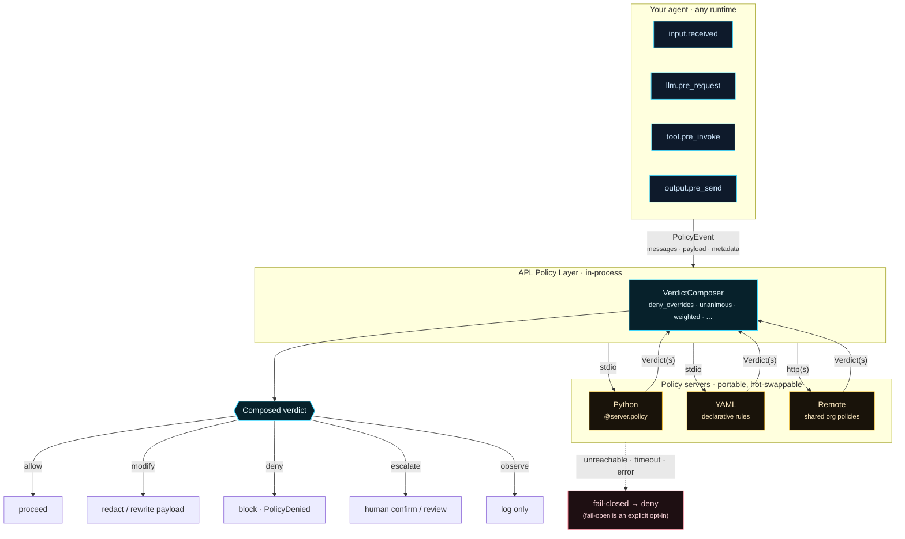

<div align="center">

<h1>APL🛡️ <br/> Agent Policy Layer</h1>

<p>
  <strong>Portable, composable, fail-closed guardrails for AI agents.</strong>
</p>

<p>
  <em>Like MCP — but for constraints instead of capabilities.</em>
</p>

<p>
<em>
<a href="https://www.agentpolicylayer.com">www.agentpolicylayer.com</a>
</em>
</p>

<p>
  <a href="https://github.com/nimonkaranurag/agentpolicylayer/actions/workflows/ci.yml">
    
  </a>
  <a href="https://github.com/nimonkaranurag/agentpolicylayer/actions/workflows/codeql.yml">
    
  </a>
  <a href="https://codecov.io/gh/nimonkaranurag/agentpolicylayer">
    
  </a>
  <a href="https://pypi.org/project/agent-policy-layer/">
    
  </a>
  <a href="https://pypi.org/project/agent-policy-layer/">
    
  </a>
  <a href="LICENSE">
    
  </a>
</p>

<br/>


<p>
  <em>APL restrains your agents — when you need him to! 🚔</em>
</p>

<br/>


<p>
  <em>
    The agent drafts a reply containing PII. APL intercepts at
    <code>output.pre_send</code>, the policies vote, and the message that
    actually goes out is redacted — without changing a line of the agent.
  </em>
</p>

</div>

---

## Table of contents

- [Why APL?](#why-apl)
- [How it works](#how-it-works)
- [Install](#install)
- [Quick start](#quick-start)
- [Writing policies](#writing-policies)
- [Connect it to your agent](#connect-it-to-your-agent)
- [Composing multiple policies](#composing-multiple-policies)
- [Fail-closed by design](#fail-closed-by-design)
- [Reference](#reference)
- [Examples](#examples)
- [Contributing](#contributing)

---

## Why APL?

Agents are increasingly trusted with real actions — sending email, calling tools, touching production data. The same traits that make them useful (open-ended reasoning, tool use) make them hard to constrain, and a system prompt that says *"never reveal PII"* is a suggestion, not a guarantee.

APL is a small protocol for wrapping an agent in **enforceable** policies, independent of the framework it's built on. A policy observes a moment in the agent's lifecycle — a user message, an LLM request, a tool call, an outgoing response — and returns a **verdict**:

| Verdict | Meaning |
|---|---|
| `allow` | proceed unchanged |
| `deny` | block the action |
| `modify` | rewrite the payload (redact, replace, append, patch) and continue |
| `escalate` | hand off to a human (confirm / review) |
| `observe` | record it; don't block |

Policies live in **policy servers** your agent connects to over stdio or HTTP. The same policy works whether your agent is raw OpenAI calls, a LangGraph graph, or something bespoke — and you can update a policy without redeploying the agent.

**What APL is not:** it isn't a model or a classifier. You bring the detection logic — a regex, an LLM call, a classifier, a lookup. APL is the lifecycle hooks, the verdict vocabulary, the composition of many policies into one decision, and the enforcement around them. The design borrows MCP's shape: where MCP gives a model *capabilities* through a uniform protocol, APL applies *constraints* through one.

What that buys you:

- **Runtime-agnostic** — one policy, any agent stack.
- **Rich verdicts** — `modify` / `escalate` / `observe`, not just allow/deny.
- **Declarative or code** — author in Python, or in YAML with no Python at all.
- **Composable** — run many policy sources at once with defined merge semantics.
- **Fail-closed** — if a policy can't be reached or times out, the action is **denied** by default. Fail-open is an explicit, logged opt-in. ([details](#fail-closed-by-design))
- **One-line auto-instrumentation** — patch OpenAI / Anthropic / LiteLLM / LangChain / watsonx in place.

---

## How it works

One event fires in your agent. APL builds a `PolicyEvent`, fans it out to every connected policy server, collects the verdicts, **composes** them into a single decision, and enforces it. If any server is unreachable, the composition fails closed.


```mermaid
flowchart TB
    subgraph agent["Your agent · any runtime"]
        direction LR
        E1["input.received"]:::evt
        E2["llm.pre_request"]:::evt
        E3["tool.pre_invoke"]:::evt
        E4["output.pre_send"]:::evt
    end

    agent -->|"PolicyEvent<br/><small>messages · payload · metadata</small>"| layer

    subgraph layer["APL Policy Layer · in-process"]
        compose["VerdictComposer<br/><small>deny_overrides · unanimous · weighted · …</small>"]:::core
    end

    layer -->|stdio| p1
    layer -->|stdio| p2
    layer -->|"http(s)"| p3

    subgraph servers["Policy servers · portable, hot-swappable"]
        direction LR
        p1["Python<br/><small>@server.policy</small>"]:::srv
        p2["YAML<br/><small>declarative rules</small>"]:::srv
        p3["Remote<br/><small>shared org policies</small>"]:::srv
    end

    p1 & p2 & p3 -->|"Verdict(s)"| compose
    compose --> enforce{{"Composed verdict"}}:::core

    enforce -->|allow| r1["proceed"]
    enforce -->|modify| r2["redact / rewrite payload"]
    enforce -->|deny| r3["block · PolicyDenied"]
    enforce -->|escalate| r4["human confirm / review"]
    enforce -->|observe| r5["log only"]

    servers -.->|"unreachable · timeout · error"| fc["fail-closed → deny<br/><small>(fail-open is an explicit opt-in)</small>"]:::warn

    classDef evt fill:#0e1a2b,stroke:#3fd8ff,stroke-width:1px,color:#cfe9ff;
    classDef core fill:#07212b,stroke:#3fd8ff,stroke-width:1.5px,color:#e8faff;
    classDef srv fill:#19130a,stroke:#fbbf24,stroke-width:1px,color:#fde9c0;
    classDef warn fill:#1e0f12,stroke:#fb7185,stroke-width:1px,color:#ffd9df;
```

### Lifecycle events

A policy subscribes to one or more events and only receives those.

| Event | Fires | Typical use |
|---|---|---|
| `input.received` | a user message arrives | prompt-injection / input validation |
| `llm.pre_request` | before calling the model | budget & cost limits, prompt rewriting |
| `llm.post_response` | after the model replies | hallucination / grounding checks |
| `tool.pre_invoke` | before a tool runs | permission checks, confirm destructive actions |
| `tool.post_invoke` | after a tool returns | result validation |
| `output.pre_send` | before the reply reaches the user | **PII redaction**, content filtering |

<details>
<summary>Full event list</summary>

`input.received` · `input.validated` · `plan.proposed` · `plan.approved` · `llm.pre_request` · `llm.post_response` · `tool.pre_invoke` · `tool.post_invoke` · `agent.pre_handoff` · `agent.post_handoff` · `output.pre_send` · `session.start` · `session.end`

</details>

---

## Install

```bash
pip install agent-policy-layer
```

Pure Python, no external services. Requires Python 3.10+. For the LangGraph adapter: `pip install "agent-policy-layer[langgraph]"`.

---

## Quick start

**1 · Write a policy** — `guard.py`:

```python
import re
from apl import PolicyServer, Verdict

server = PolicyServer("guard")

@server.policy(name="redact-ssn", events=["output.pre_send"])
async def redact_ssn(event):
    text = event.payload.output_text or ""
    if re.search(r"\d{3}-\d{2}-\d{4}", text):
        return Verdict.modify(
            target="output",
            operation="replace",
            value=re.sub(r"\d{3}-\d{2}-\d{4}", "[SSN REDACTED]", text),
            reasoning="Redacted SSN",
        )
    return Verdict.allow()

if __name__ == "__main__":
    server.run()  # stdio by default; `server.run(transport="http", port=8080)` for HTTP
```

**2 · Try it** — no agent required:

```bash
apl test ./guard.py -e output.pre_send -p '{"output_text": "Your SSN is 123-45-6789"}'
# → MODIFY  ·  output → "Your SSN is [SSN REDACTED]"  ·  Redacted SSN
```

**3 · Put it in front of your LLM** — one line, and `output.pre_send` runs on every reply:

```python
import apl
apl.auto_instrument(policy_servers=["stdio://./guard.py"])

from openai import OpenAI
resp = OpenAI().chat.completions.create(model="gpt-4o", messages=[...])
print(resp.choices[0].message.content)  # already redacted if a policy fired
```

That's the whole loop: author a verdict, see it in isolation, then enforce it live.

---

## Writing policies

A policy is a function that takes a [`PolicyEvent`](apl/types.py) and returns a [`Verdict`](apl/types.py). The five verdict constructors:

```python
Verdict.allow()
Verdict.deny(reasoning="contains prohibited content")
Verdict.modify(target="output", operation="replace", value="[REDACTED]", reasoning="PII detected")
Verdict.escalate(type="human_confirm", prompt="Delete production database?", options=["Proceed", "Cancel"])
Verdict.observe(reasoning="logged for audit", trace={"action": "sensitive_query"})
```

`modify` carries a `target` and an `operation`, both enforced end-to-end:

| `target` | `operation` |
|---|---|
| `input` · `llm_prompt` · `tool_args` · `tool_result` · `output` · `plan` · `handoff_payload` | `replace` · `redact` · `append` · `prepend` · `patch` (with a JSON `path`) |

### In Python

`@server.policy` registers a handler. Declare the `events` it subscribes to, and optionally the `context` paths it needs:

```python
from apl import PolicyServer, Verdict

server = PolicyServer("safety", description="Confirm destructive tool calls")

@server.policy(
    name="confirm-delete",
    events=["tool.pre_invoke"],
    context=["payload.tool_name", "payload.tool_args"],
)
async def confirm_delete(event):
    tool = (event.payload.tool_name or "").lower()
    if any(word in tool for word in ("delete", "drop", "destroy")):
        return Verdict.escalate(
            type="human_confirm",
            prompt=f"⚠️ Destructive action: {event.payload.tool_name}. Proceed?",
            options=["Proceed", "Cancel"],
        )
    return Verdict.allow()
```

### In YAML — no Python required

The same kinds of rules, declaratively. Serve a `.yaml` file exactly like a `.py` one.

```yaml
# compliance.yaml
name: corporate-compliance
version: 1.0.0

policies:
  - name: block-competitor-info
    events: [output.pre_send]
    rules:
      - when:
          payload.output_text: { contains: "competitor financials" }
        then:
          decision: deny
          reasoning: "Cannot share competitor financial information"

  - name: confirm-eu-export
    events: [tool.pre_invoke]
    rules:
      - when:
          payload.tool_name: { matches: ".*export.*" }
          metadata.user_region: { in: [EU, EEA, UK] }
        then:
          decision: escalate
          escalation:
            type: human_confirm
            prompt: "🇪🇺 GDPR: confirm data export for an EU user?"
```

```bash
apl validate ./compliance.yaml   # checks operators, modification & escalation shapes
apl serve ./compliance.yaml --http 8080
```

Supported condition operators: `equals` · `matches` (case-insensitive regex, matches anywhere) · `contains` · `in` · `gt` · `gte` · `lt` · `lte` · `not` · `any` · `all`. Unknown operators are rejected at load time rather than silently skipped.

---

## Connect it to your agent

Four ways in, from least to most explicit.

### Auto-instrumentation

Patches the SDKs you have installed — **OpenAI, Anthropic, LiteLLM, LangChain, watsonx** — so every call flows through your policies.

```python
import apl

state = apl.auto_instrument(
    policy_servers=["stdio://./guard.py", "https://policies.corp.com/compliance"],
    user_id="user-123",
    # enabled_providers=["openai"],     # default: every installed provider
    # fail_mode=apl.FailMode.OPEN,      # default: CLOSED (see below)
)
# ... use your LLM SDK as normal ...
apl.uninstrument(state)
```

On each call, `modify` verdicts rewrite the request/response before your code sees it; `deny` and `escalate` raise `PolicyDenied` / `PolicyEscalation`. Prefer a scoped block? Use the context manager, which always restores the SDKs on exit:

```python
with apl.instrument(policy_servers=["stdio://./guard.py"]):
    ...
```

> Streamed responses are buffered so output policies can run on the full text before any chunk is delivered — a `deny` actually stops the stream. That's the honest cost of enforcing guardrails on a stream.

### Manual evaluation

Full control: build the event, read the verdict, decide what to do.

```python
from apl import PolicyLayer, EventPayload, SessionMetadata

layer = PolicyLayer()
layer.add_server("stdio://./guard.py")

verdict = await layer.evaluate(
    event_type="output.pre_send",
    payload=EventPayload(output_text=response_text),
    metadata=SessionMetadata(user_id="user-123"),
)

if verdict.decision.value == "modify":
    response_text = verdict.modifications[0].value
elif verdict.decision.value == "deny":
    raise RuntimeError(verdict.reasoning)
```

### Decorator

Wrap a function so a verdict is enforced around each call — `deny`/`escalate` raise, `modify` rewrites the `tool_args`:

```python
@layer.on("tool.pre_invoke")
async def call_tool(tool_name: str, tool_args: dict):
    ...

try:
    await call_tool("delete_record", {"id": 42})
except apl.PolicyEscalation as e:
    print(e.verdict.escalation.prompt)
```

### LangGraph

`wrap()` instruments a `StateGraph`'s nodes; it raises `TypeError` on anything that isn't a graph (never a silent no-op).

```python
from apl import PolicyLayer

guarded = PolicyLayer().add_server("stdio://./guard.py").wrap(graph)
```

For custom checkpoints, use [`APLGraphWrapper`](apl/adapters/langgraph.py) and `add_checkpoint(event_type, node_name=..., before=...)` directly.

---

## Composing multiple policies

When several policies (or servers) weigh in on one event, a **composition strategy** reduces their verdicts to one. Configure it on the layer:

```python
from apl import PolicyLayer, CompositionConfig, CompositionMode

layer = PolicyLayer(composition=CompositionConfig(
    mode=CompositionMode.DENY_OVERRIDES,   # default
    timeout_ms=500,
    weights={"trusted-policy": 2.0},       # used by WEIGHTED
    priority=["pii-filter"],               # used by FIRST_APPLICABLE
))
```

| Mode | How verdicts combine |
|---|---|
| `deny_overrides` *(default)* | any `deny` wins; else `escalate`; else apply all `modify`; else `allow` |
| `allow_overrides` | any `allow` wins; else `modify`; else `escalate`; else `deny` |
| `unanimous` | every non-`observe` verdict must be `allow`, otherwise `deny` |
| `first_applicable` | first non-`observe` verdict wins, in `priority` order |
| `weighted` | confidence × per-policy weight vote; `escalate` short-circuits; `deny` breaks ties |

---

## Fail-closed by design

APL is a guardrails layer, so its defaults assume that **a guard you can't consult is a guard that says no.**

- **Unavailable → deny.** If a policy times out, errors, returns a non-verdict, or its server is unreachable, the result is `deny` (`FailMode.CLOSED`). Enforcement isn't silently skipped.
- **Fail-open is explicit and loud.** `FailMode.OPEN` must be passed deliberately (`PolicyLayer(composition=CompositionConfig(fail_mode=FailMode.OPEN))` or `auto_instrument(..., fail_mode=FailMode.OPEN)`), and it logs a warning on startup.
- **Layer timeout fails closed too.** `CompositionConfig.timeout_ms` bounds the whole evaluation; on expiry it returns `on_timeout` (default `deny`).
- **Protocol version is checked on connect.** An incompatible server is treated as unavailable rather than trusted.

Safe-by-default also extends to the HTTP transport:

- binds **`127.0.0.1`** (not `0.0.0.0`),
- optional **bearer-token auth** (`--auth-token`), constant-time compared,
- **CORS allow-list** instead of `*` — no CORS headers unless an origin is allow-listed,
- **request-size and content-type guards**; malformed input returns a `4xx` with a stable error envelope, never an echoed traceback.

---

## Reference

### CLI

```text
apl serve POLICY [--http PORT] [--host HOST] [--auth-token TOKEN]
                 [--cors-origin ORIGIN]... [--max-body BYTES] [-v|-q]
apl test  POLICY [-e EVENT] [-p JSON_PAYLOAD]
apl validate POLICY
apl init  NAME [-t basic|pii|budget|confirm]
apl info
```

`POLICY` is a `.py` file, a `.yaml` file, or a directory of them. `serve` uses **stdio** unless `--http PORT` is given.

<details>
<summary>Examples</summary>

```bash
apl serve ./guard.py                       # stdio (for stdio:// clients)
apl serve ./guard.py --http 8080           # HTTP on 127.0.0.1:8080
apl serve ./policies/ --http 8080 \        # serve a directory
  --auth-token "$APL_TOKEN" --cors-origin https://app.corp.com
apl test ./guard.py -e tool.pre_invoke -p '{"tool_name": "delete_db"}'
apl init my-guard -t pii                   # scaffold a new policy project
apl info                                   # version, protocol, transports, adapters
```

</details>

### Python API

```python
from apl import (
    PolicyServer, PolicyLayer, PolicyClient,          # core
    Verdict, Decision, Modification, Escalation,       # verdicts
    EventType, PolicyEvent, EventPayload,              # events
    Message, ToolCall, FunctionCall, SessionMetadata,  # context (chat/completions shape)
    CompositionMode, CompositionConfig, VerdictComposer,
    FailMode,                                           # CLOSED (default) | OPEN
    PolicyDenied, PolicyEscalation, PolicyUnavailableError,
    auto_instrument, instrument, uninstrument,          # SDK patching
    load_yaml_policy, validate_yaml_policy,             # declarative
    APLGraphWrapper,                                    # LangGraph
    setup_logging, get_logger,
)
```

| Object | Key surface |
|---|---|
| `PolicyServer(name, version=…, description=…)` | `@server.policy(name, events, context=…, blocking=True, timeout_ms=1000)`, `server.run(transport="stdio"\|"http", **kw)` |
| `PolicyLayer(composition=…)` | `.add_server(uri)` → self, `await .evaluate(event_type, messages=…, payload=…, metadata=…)` → `Verdict`, `.on(event)`, `.wrap(graph)`, `.fail_mode`, `await .close()` |
| `Verdict` | `.decision`, `.confidence`, `.reasoning`, `.modifications`, `.escalation` + the five constructors |

Server URIs: `stdio://./policy.py` · `http://host:port` · `https://host`.

### HTTP API

When a server runs with `--http`:

| Method | Endpoint | Purpose |
|---|---|---|
| `POST` | `/evaluate` | evaluate a `PolicyEvent`, return per-policy + composed verdicts |
| `GET` | `/manifest` | the server's policies and protocol version |
| `GET` | `/health` | status, policies loaded, uptime |
| `GET` | `/metrics` | Prometheus metrics |
| `GET` | `/events` | Server-Sent Events stream |

---

## Examples

Runnable policies in [`examples/`](examples/):

| File | Shows |
|---|---|
| [pii_filter.py](examples/pii_filter.py) | redact SSNs, cards, emails on `output.pre_send`; block PII in tool calls |
| [budget_limiter.py](examples/budget_limiter.py) | token & cost budgets from session metadata; `observe` warnings, `deny` over budget |
| [confirm_destructive.py](examples/confirm_destructive.py) | `escalate` for destructive tools; role-aware checks |
| [compliance.yaml](examples/compliance.yaml) | the same ideas, declaratively |
| [usage_demo.py](examples/usage_demo.py) | manual evaluation, the decorator API, and composition |

```bash
apl serve examples/pii_filter.py --http 8080
```

---

## Contributing

Issues and PRs welcome — see [CONTRIBUTING.md](CONTRIBUTING.md), the [security policy](SECURITY.md), and the [code of conduct](CODE_OF_CONDUCT.md).

Licensed under [Apache 2.0](LICENSE).
